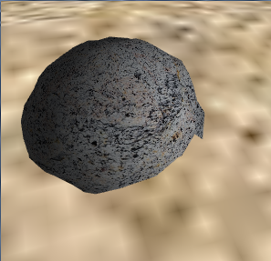
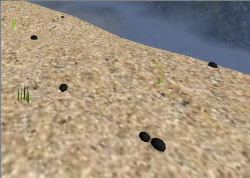
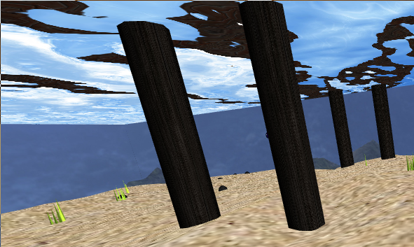

# CGRA 2020/2021

## Group T2xG5y

Fernando Rego - up201905951

Tiago Rodrigues - up201907021

## Project Notes

The projects suits all the requirements asked of it, with a slight aesthetic modification: the radius of the automated fish is smaller than 5 units.
This happens because, after experimentation, a wider radius made the fish go out of bounds too often. As such, a smaller radius would prove
more suited to the size of our scene, and the rest of the fish's movements are not affected by the changes. We think this change does not deviate significantly
from the requirements and still gives a reasonable solution to the issue. Also, the out of bound issue was solved by reducing the area where the fish can spawn,
but still giving it enough space to not spawn always in the same places.

## Screenshots

### 1 - MyFish

### 2 - Sea Floor

### 3 - Water Surface

### 4 - Rock and Rock sets

### 5 - Pillar Set

### 6 - Updated Sea Floor

### 7 - Fish catching Rocks

